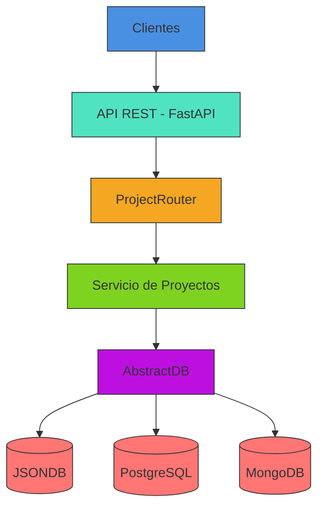

# Microservicio de Gestión de Proyectos

## Diagrama de Arquitectura



## Estructura de Carpetas

📁 Projects-service  
├── 📁 src  
│   ├── 📁 database  
│   │   ├── 📄 AbstradDB.py  
│   │   ├── 📄 DBSelect.py  
│   │   ├── 📄 JSONDB.py  
│   │   ├── 📄 MongoDB.py  
│   │   └── 📄 PostgreSQLDB.py  
│   ├── 📁 models  
│   │   └── 📄 projects.py  
│   ├── 📁 schemas
│   │   └── 📄 projects_schema.py
│   ├── 📄 `__init__`.py
├── 📁 tests  
│   └── 📄 project_test.py  
├── 📄 config.py
├── 📄 projects_routes.py  
└── 📄 requirements.txt

__Descripción de Directorios:__

- `src/`: Código fuente principal
  - `api/`: Endpoints y routers FastAPI
  - `services/`: Lógica de negocio
  - `database/`: Conexiones y abstracciones DB
  - `schemas/`: Modelos Pydantic
- `docs/`: Documentación técnica
- `config/`: Configuraciones y variables de entorno
- `tests/`: Pruebas unitarias e integración

## Estructura Técnica

### 1. Capa API

- __Router__: `projects_routes.py`
  - Endpoints REST para operaciones CRUD
  - Validación automática con modelos Pydantic
  - Manejo de errores HTTP

```python
@ProjectRouter.post("/projects/", response_model=ProjectOut)
def create_project(project: ProjectCreate):
    """Create a new project."""
    return db.create_project(project)
```

### 2. Capa de Servicio

- __AbstractDB__: `AbstradDB.py`
  - Interfaz abstracta para operaciones de base de datos
  - Patrón Repository para desacoplamiento
  - Implementaciones concretas:
    - `JSONDB`: Almacenamiento en archivo JSON
    - `PostgreSQLDB`: Base de datos relacional
    - `MongoDB`: Base de datos NoSQL

### 3. Capa de Datos

- __Esquemas__: `projects_schema.py`
  - Modelos Pydantic para:
    - Validación de entrada/salida
    - Documentación automática de API
  - Configuración ORM para integración con DB

### 4. Configuración

- __DB_USE__: `config.py`
  - Selección dinámica de base de datos
  - Estrategia de inyección de dependencias

```python
def get_repo(db_type: str):
    """Get the appropriate database repository based on type."""
    if db_type == "JSONDB":
        return JSONDB("projects.json")
```

## Flujo de Datos

1. Cliente realiza petición HTTP
2. Router valida entrada con esquemas Pydantic
3. Servicio ejecuta lógica de negocio
4. Repositorio interactúa con la base de datos
5. Respuesta se serializa con modelo ProjectOut

## Consideraciones de Diseño

- Desacople total entre capas
- Fácil intercambio de proveedores de base de datos
- Documentación automática mediante OpenAPI
- Tipado fuerte con validación en tiempo de ejecución
